# ⚽ NextGenFootball Bulgaria — Empowering Youth Football

Welcome to **NextGenFootball**, the all-in-one platform designed to support the youth football ecosystem in Bulgaria.  
This web application covers every aspect needed for thriving youth leagues, from administration and match management to interactive news and player statistics.  
Let’s inspire the next generation! 🇧🇬👦👧

---

## 🌟 Main Idea

NextGenFootball is built to **connect and empower youth football in Bulgaria**, providing clubs, organizers, coaches, referees, and fans with powerful tools to manage, follow, and grow the sport.  
Whether you’re a guest, player, coach, referee, league manager, or administrator — you’ll find all the features you need for your role. 🏟️⚽👥

---

## 🚀 Features by User Role

### 👀 Guest / Logged-in User

- 📰 **Browse Latest News:** Stay up-to-date with dynamic news feeds and search (AJAX-powered).
- 🏆 **League Standings:** View current positions across different youth leagues.
- 📅 **Match Details:** See results, events, squads, and statistics for every match.
- 🧑‍🎓 **Player Profiles & Stats:** Detailed info on youth players and their achievements.
- 👕 **Team Details:** Discover teams, their squads, and season performance.
- 🏟️ **Stadium Details** Stadium details and location provided.
- 📹 **Video** Videos with highlights or full matches provided.

#### 📸 Screenshots:  
- 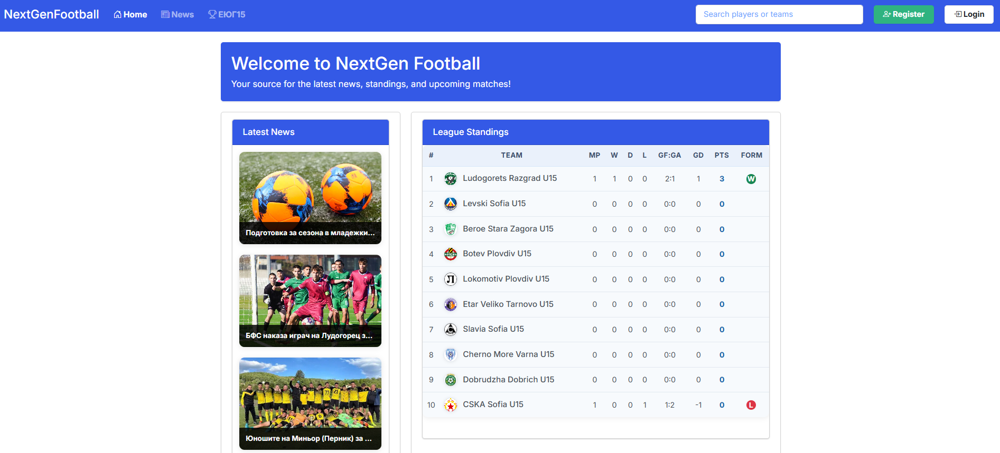
- 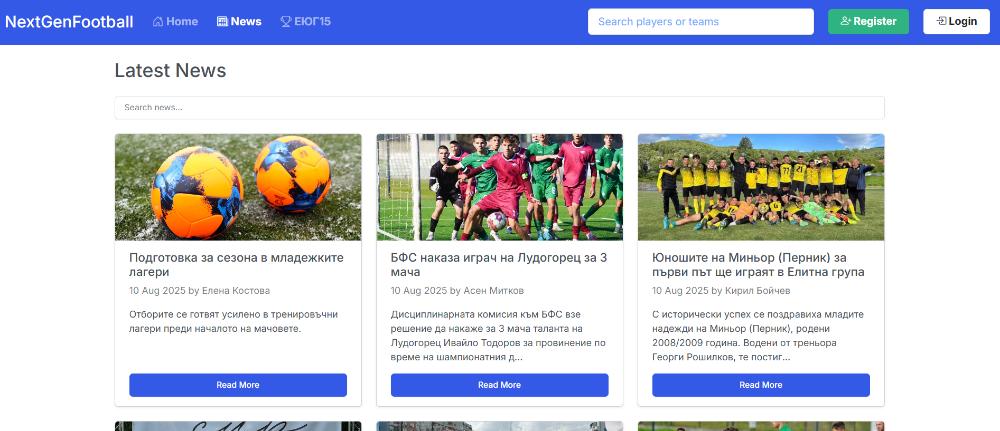
- 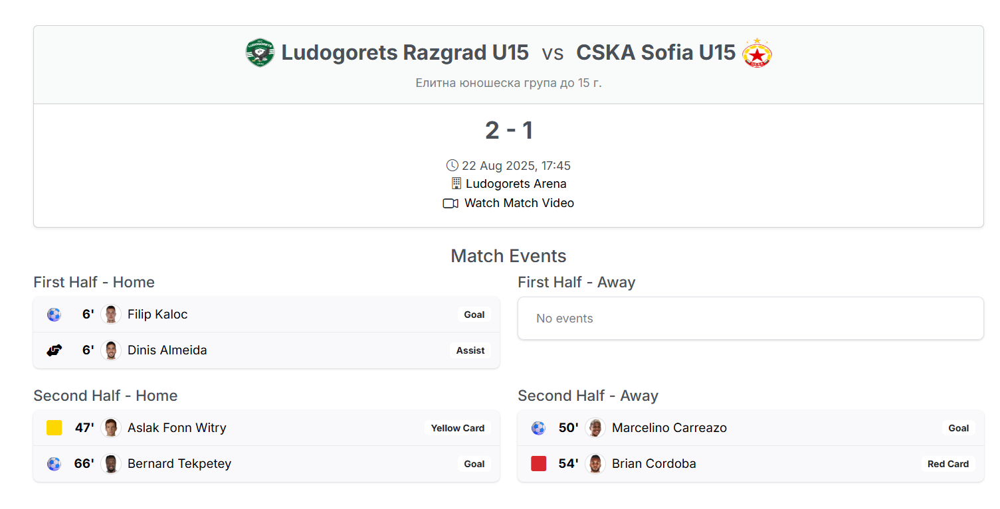
- 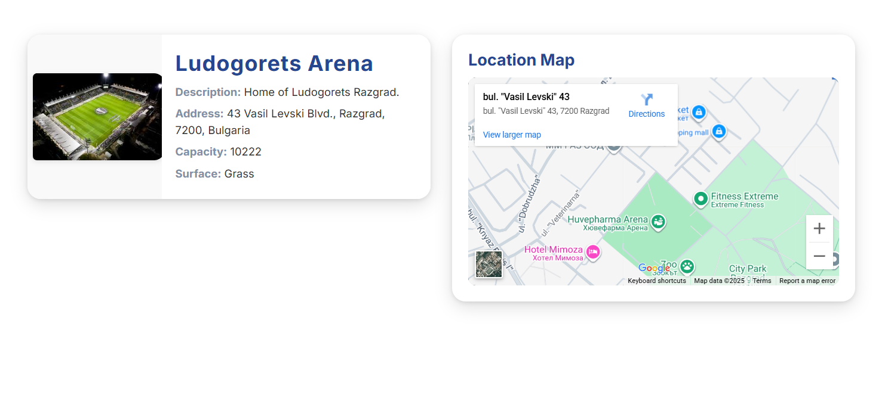
---

### 🏆 League Manager

- 🎩 **League Management:** Create and edit leagues, manage competitions.
- ➕ **Add Matches:** Schedule and manage upcoming matches for your league.
- 🧑‍⚖️ **Referee Assignment:** Assign referees to matches with ease.
- 🗞️ **Publish News:** Create and manage league-specific news articles.

#### 📸 Screenshots:  

- 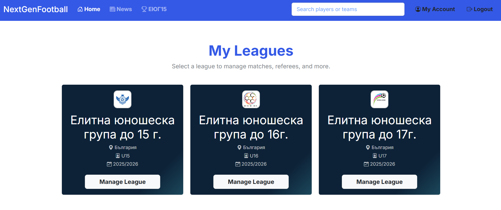
- 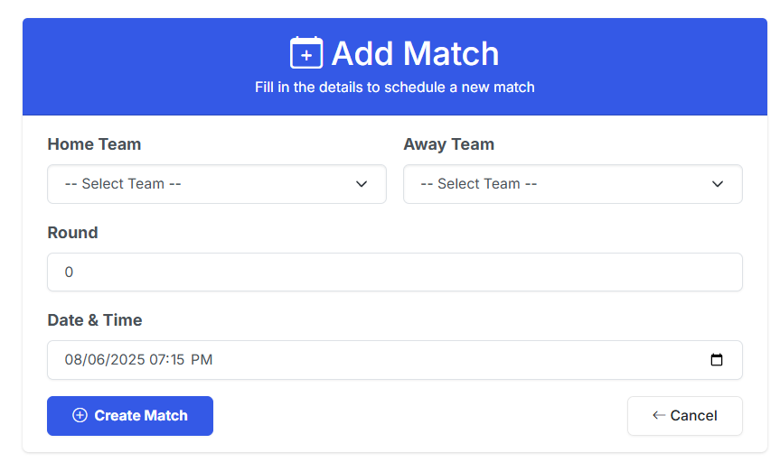
- 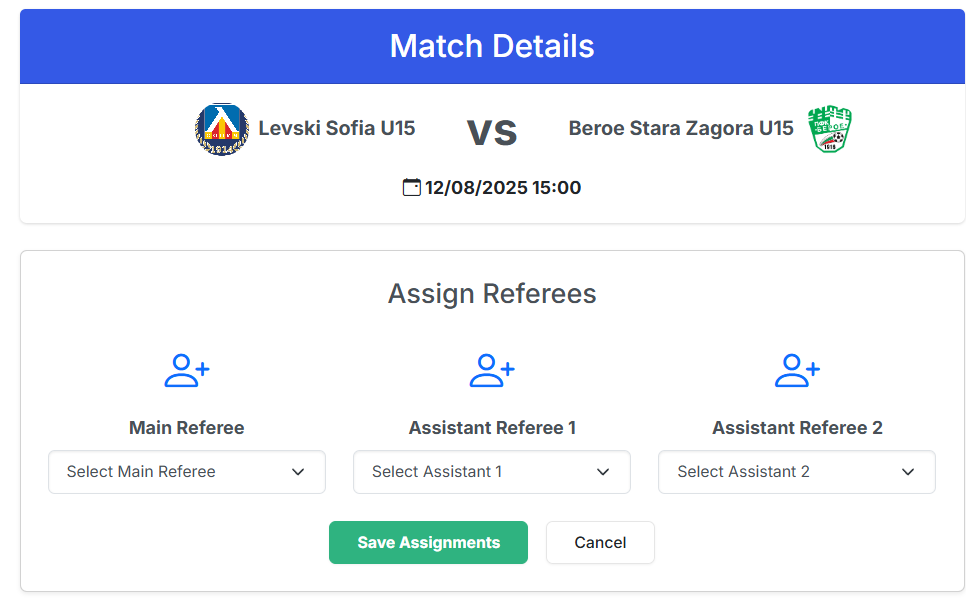

---

### 🧑‍⚖️ Referee

- 📝 **Match Reports:** Fill out intelligent match reports for assigned games.
- 💾 **Event Persistence:** All events (goals, cards, etc.) are saved to the database for accurate records.

#### 📸 Screenshots:  
- 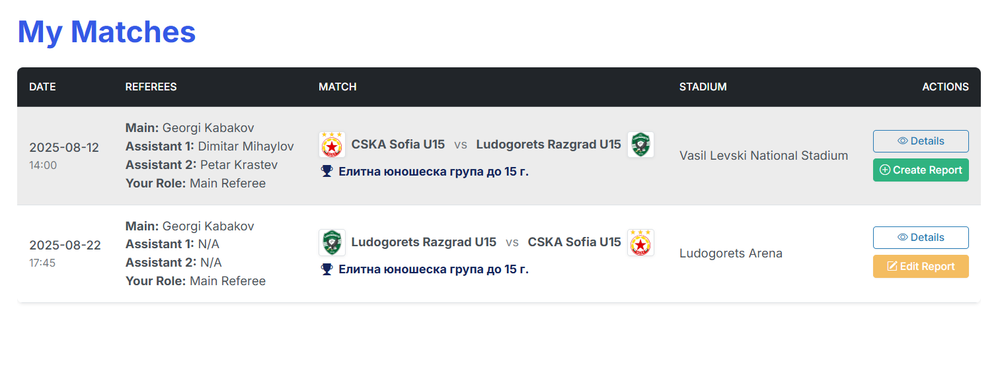
- 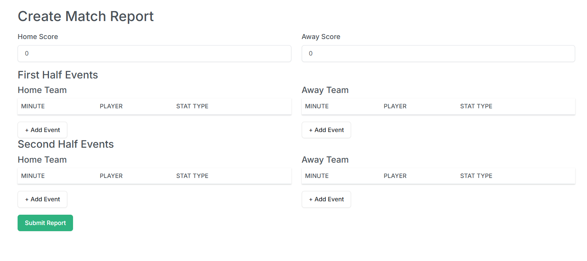

---

### 🛡️ Admin

- 👤 **User Management:** Create, edit, and remove users.
- 🏟️ **Full CRUD:** Teams, players, stadiums, coaches, referees, matches, seasons, and leagues.
- 🏷️ **Assign Roles:** Link application user accounts to coaches and referees.

#### 📸 Screenshots:  

- 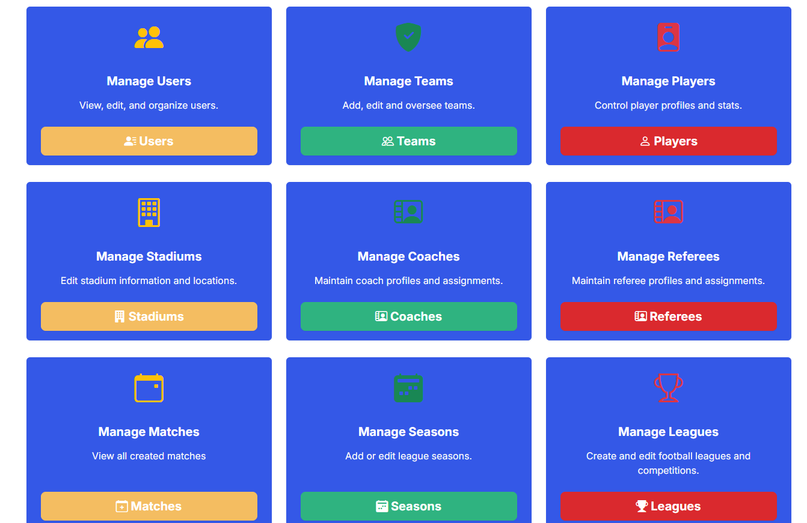
- 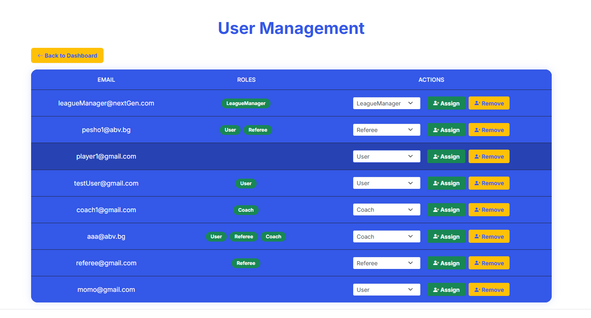

---

### 🧑‍💼 Coach

- 🧩 **Lineup Creation:** Design beautiful starting elevens with drag-and-drop formation builder.
- 🎯 **Match Integration:** Lineups are saved and displayed in match details.
- 📆 **Upcoming Matches:** See all matches for your team at a glance.

#### 📸 Screenshots:  

- 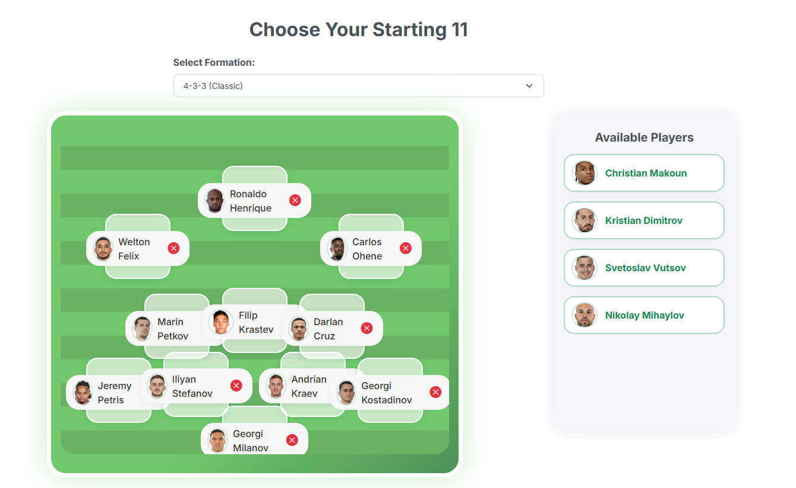
- 

---

## 🖥️ Technologies Used

- ⚙️ **ASP.NET Core MVC**  
- 🗄️ **Entity Framework Core**  
- 🏢 **SQL Server**  
- 🎨 **Bootstrap 5**  
- 💻 **jQuery & AJAX**  
- 🖼️ **FontAwesome & Bootstrap Icons**  
- 📱 **Responsive Design**  
- 🔒 **Authentication & Role-based Authorization**  
- 🧩 **Custom JavaScript for Interactive Components**  

---

## 📝 Demo Credentials

Use these demo credentials to explore the different roles:

| Role               | Email                        | Password  |
|--------------------|-----------------------------|-----------|
| 👤 Test User       | testUser@gmail.com           | 123456    |
| 🛡️ Test Admin      | admin@nextGen.com            | 123456    |
| 🧑‍⚖️ Test Referee  | referee@gmail.com            | 123456    |
| 🏆 Test LeagueManager| leagueManager@nextGen.com  | 123456    |
| 🧑‍💼 Test Coach     | coach1@gmail.com             | 123456    |

> **Note:**  
> If you want to test the **Coach** or **Referee** features, make sure to assign your application user ID to a coach or referee in the Admin Panel. ⚠️

---

## 🎨 Screenshots Folder

All screenshots showcasing the app’s features should be added to the `/Screenshots` folder.  
This helps users preview the UI and main functionalities for each role.  
Feel free to add or update images as the app evolves!

---

## 📢 Get Started

Clone the repository, run the migrations, and seed the database for instant access to all demo roles.

---

## 💬 Contact & Contribute

Questions or suggestions? Open an issue or pull request!  
Help us make youth football in Bulgaria even better. 🌍📝

---

_Made with ❤️ for Bulgarian youth football!_ 🇧🇬⚽
